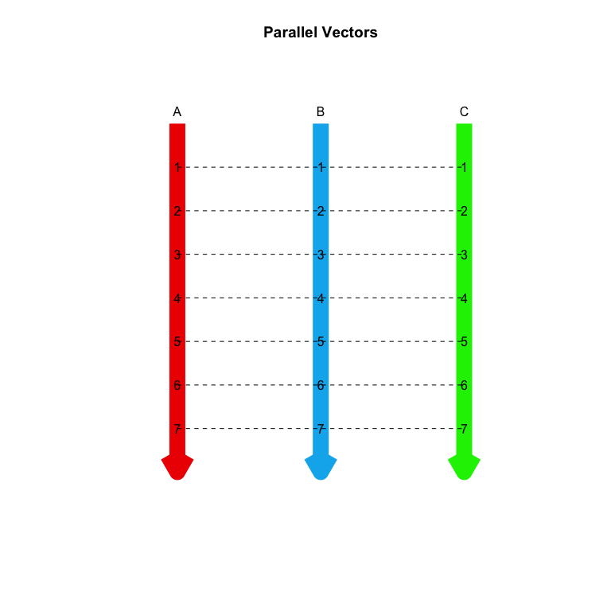
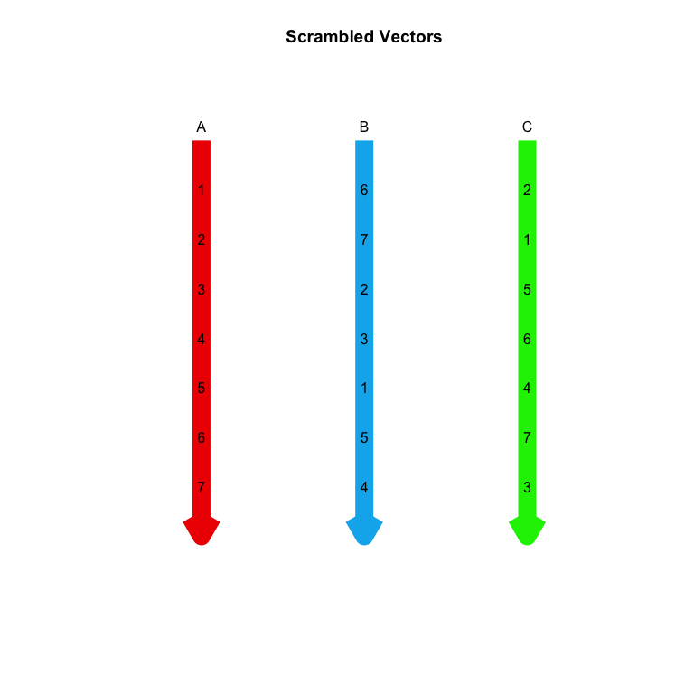
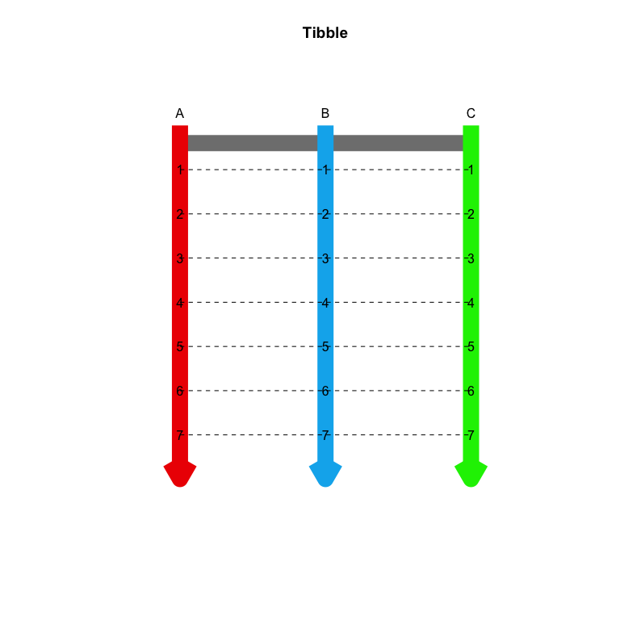
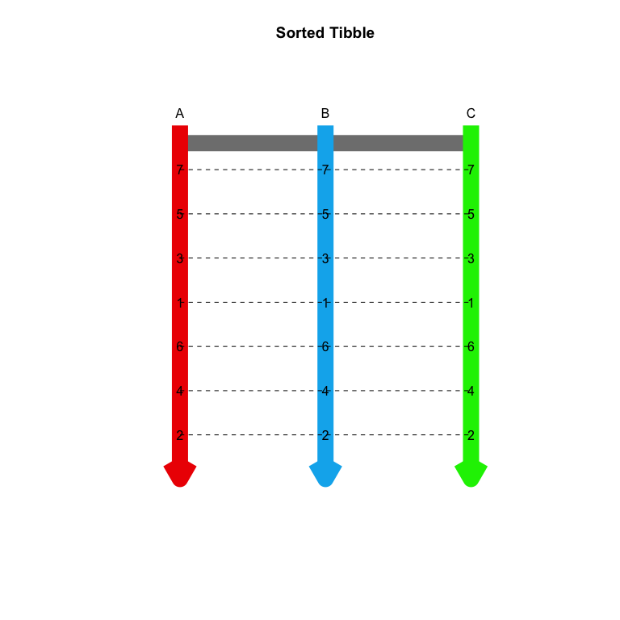

# tutorialsPascuzziPE

These learnR tutorials were written to teach R and tidyverse to students not majoring in a data science domain, predominately the life sciences.  They are a work in progress.  You will need to install the packages **devtools** and **learnr** to run the tutorials.

There are currently nine tutorials:

+ "T01_GettingStarted"
+ "T02_DataTypes"
+ "T03_UsingVectors"
+ "T04_Tibbles"
+ "T05_IntroToGgplot2"
+ "T06_DataWrangling01"
+ "T07_WritingFunctions"
+ "T08_UsingLapply"
+ "T09_HierarchicalClustering"

You run a tutorial using the `run_tutorial` function in the **learnr** package.

# How to install and run a tutorial

```
install.packages(c("learnr", "devtools"))
devtools::install_github("https://github.com/pepascuzzi/tutorialsPascuzziPE.git")
library(learnr)
run_tutorial(name="T01_GettingStarted", package="tutorialsPascuzziPE")
```
Alternatively, you can open the Rmd file directly in RStudio by locating the package directory in your R library.  The tutorials are in a subdirectory named tutorials.  You can then Run Document from RStudio.  Be careful with this method because you can accidently change the Rmd file!  

An example tutorial is shown below.  

# T04 Tibbles
A rendered version of tutorial 4 is shown below as a preview.  It is not interactive!

## Introduction  
**R** has existed for more than 20 years, but there has been explosive growth in **R** in the last five years.  This has lead to the re-evaluation of how certain things are done in **R**.  


The standard **R** data structure for many analyses is the **data frame**.  Likewise, the standard **R** package for plotting is named **graphics**.  If you continuing working in **R**, you will certainly encounter both.   

However, new packages suchs as **dplyr** and **ggplot2** are strongly supported by **RStudio** with Cheatsheets embedded in the **RStudio** Help menu.  In addition, the naming conventions and syntax of these packages are more literate, making them easier to read, and uniform, making them easier to learn.  Many of these packages have been gathered into a "meta-package" named **tidyverse**.  

In this context, **tidy** has several meanings.  First, **tidy** means that the packages work best with **tidy** data, rectangular data with records/observations/samples in rows and variables in columns.  Second, **tidy** means that the **R functions** are easy to use with consistent syntax.  Three, **tidy** means that the **R code** is structured so that it is literate and easy to follow.  

## Tibbles  

The previous tutorial on **vectors** demonstrated that you can perform data analyses with simple **R objects**.  However, this approach is fraught with potential problems because data in a **vector** has a specific order.  If the **values** in a **vector** are changed, then mistakes can occur.  

This tutorial covers **tibbles**, a modified version of a **data frame**, a very common **R** data structure similar to an Excel worksheet in some respects.  **Tibbles** retain the best features of a **data frame**, but discard some problematics issues.  In addition, **tibbles** have new features that make them very efficient for data analysis.  

You have already worked with **numeric** and **character vectors** and a similar **object** called a **factor**.  You used these **objects** to create plots and tables to explore data.  This was possible because the data in these objects was parallel, i.e. the **vectors** were ordered so that data at each position applied across the **vectors**. 

Run the cell below to produce a plot to illustrate this point.



However, you can sort or reorder **vectors**, so what happens if your values are no longer aligned? 

Run the cell below to produce a plot that illustrates this situation.



As shown in the plot, the positions in **vector** `B` and `C` are no longer parallel with **vector** `A`.  Any analysis that uses data in **vector** `B` or `C` will not be accurate. 

So, how can you store data when multiple variables are stored for each sample, record or observation?  The answer is a **tibble**, a series of linked **vectors** that create a rectangular data structure, i.e. there are rows and columns.  

Run the cell below to generate a plot that illustrates the linked **vectors** of a **tibbles**.



If you reorder the values in a **tibble**, all **vectors** in that **tibble** are also reordered.

Run the cell below to generate a plot that illustrates this.



## Create a **Tibble** with `read_delim`  

So, how do you make a **tibble**?  

There are three ways to create a **tibble**.  

1. Use the function `tibble` to create one from scratch.  
2. Use the function `as_tibble` to convert a **data frame** to a **tibble**.  
3. Use the functon `read_delim` to create a **tibble** from a text file.  

The **function** `read_delim` will create a **tibble** by reading data from a text file.  Reading data from a text file is likely the most common way to import data with **R**.  There are many ways to organize data in a text file, and a common format has data arranged in rows and columns similar to an Excel worksheet.  You can also import Excel worksheets, but that requires a different function.  


The variables or columns in these files are separated or **delim**ited by characters such as a **tab** or **comma**.  In addition, each row of data terminates with a character string that indicates a new line.  

When you started this tutorial, a **tibble** was created from the chunk below.  In the context of a **learnR tutorial**, this step cannot be made interactive.  You can see the code, but you cannot change it. 


```r
ar_exp <- read_delim(file="AR_Expression_cBioPortal.txt", delim="\t", col_names=TRUE)
```

The **argument** `delim="\t"` indicates that the file has **tab-delimited** columns.  The text pattern `"\t"` is how tabs are encoded in a plain text file.  These special characters are usually hidden by text editors and word processors.  Other common **delimiters** are commas (csv files) or spaces.  

The **argument** `col_names=TRUE` indicates that the first row should be used as column names.  This can also be set to `FALSE` if the first row of your file contains data.  Alternatively, you can provide a **character vector** of column names.  

The **argument** `col_types="cffffn"` indicates the **data type** for each column using a simple **character string** as follows:  

|Data Type  |Character|
|:--------------------|:-----|
| **character** | "c" |
| **numeric** | "n" |
| **integer** | "i" |
| **factor** | "f" |
| **logical** | "l" |
| guess | "?" |
| skip | "-" |
| **date** | "D"|
| **date time** | "T"|
| **time** | "t" |

The **argument** `na=c("", "-", "NA", "missing", "Inf", "-Inf")` indicates which values should be converted to `NA`.  This argument is very important if you read large files with numeric values where some values are missing.  Several common examples have been included here, but there are many possibilities.  

You may need to adjust these options until the data is imported as you want.  In addition, there are several other arguments that you might need.  See the help page for `read_delim`.  

Note that the function `read_delim` was used and **NOT** `read.delim`.  The first is a **tidyverse R function** that will create a **tibble**.  The latter is an **old school R** function that will create a **data frame**.  In general, do not use `read.delim` in this class because it makes certain assumptions about your data that might not be true!  

The **class** of a **tibble** is confusing.  It essentially has three classes.  Importantly, it behaves much like the **data frame**.  

```{r q65, exercise=TRUE, exercise.startover=TRUE}
class(ar_exp)
```
```
## [1] "spec_tbl_df" "tbl_df"      "tbl"         "data.frame"
```

To examine the data in a **tibble**, simply enter its name.  In an RMarkdown document, you should be able to browse down the rows and across the columns.  In addition, the size (rows and columns) and class of each variable should be shown (under the column names).  

```{r q66, exercise=TRUE, exercise.startover=TRUE}
ar_exp
```

```
## # A tibble: 9,121 x 6
##    `Sample Id`  `Cancer Study`        `Profile Name` Gene  Mutation   Value
##    <chr>        <chr>                 <chr>          <chr> <chr>      <dbl>
##  1 TCGA-OR-A5J… Adrenocortical Carci… RNA Seq V2     AR    Not Mut…  0.0849
##  2 TCGA-OR-A5J… Adrenocortical Carci… RNA Seq V2     AR    Not Mut…  7.45  
##  3 TCGA-OR-A5J… Adrenocortical Carci… RNA Seq V2     AR    Not Mut…  6.30  
##  4 TCGA-OR-A5J… Adrenocortical Carci… RNA Seq V2     AR    Not Mut…  1.28  
##  5 TCGA-OR-A5J… Adrenocortical Carci… RNA Seq V2     AR    Not Mut… -3.32  
##  6 TCGA-OR-A5J… Adrenocortical Carci… RNA Seq V2     AR    Not Mut… -3.32  
##  7 TCGA-OR-A5J… Adrenocortical Carci… RNA Seq V2     AR    Not Mut…  4.80  
##  8 TCGA-OR-A5J… Adrenocortical Carci… RNA Seq V2     AR    Not Mut…  3.16  
##  9 TCGA-OR-A5J… Adrenocortical Carci… RNA Seq V2     AR    Not Mut… -3.32  
## 10 TCGA-OR-A5J… Adrenocortical Carci… RNA Seq V2     AR    Not Mut…  2.54  
## # … with 9,111 more rows
```

This data was downloaded from [cBioPortal](http://www.cbioportal.org/){target="_blank"} and contains data for about 9100 samples from multiple cancer studies.

You can use `summary` to get a quick summary of each column or variable in a **tibble**.  Remember the issue with rounding of numbers from the **vectors** lesson!

```{r q69, exercise=TRUE, exercise.startover=TRUE}
summary(ar_exp)
```

```
##   Sample Id         Cancer Study       Profile Name      
##  Length:9121        Length:9121        Length:9121       
##  Class :character   Class :character   Class :character  
##  Mode  :character   Mode  :character   Mode  :character  
##                                                          
##                                                          
##                                                          
##      Gene             Mutation             Value       
##  Length:9121        Length:9121        Min.   :-3.322  
##  Class :character   Class :character   1st Qu.: 2.004  
##  Mode  :character   Mode  :character   Median : 4.501  
##                                        Mean   : 4.485  
##                                        3rd Qu.: 7.245  
##                                        Max.   :12.466
```

## Renaming Columns with `rename`  

One problem with this data is that the column names contain special characters, i.e. spaces.  **Base R** functions like `read.delim` (not `read_delim`) will fix these issues by replacing all special characters with a period.  The **tidyverse R** function `read_delim` will leave your column names "as is", but any column names with special characters must be used carefully.  

Here is a quick example (jumping ahead a bit).  

You can create a subset of a **tibble** by selecting specific columns by name without using quotes or back ticks.  For example, we can select the variables `Mutation` and `Value` from `ar_exp`.  

```{r q70, exercise=TRUE, exercise.startover=TRUE}
select(ar_exp, Mutation, Value)
```

```
## # A tibble: 9,121 x 2
##    Mutation      Value
##    <chr>         <dbl>
##  1 Not Mutated  0.0849
##  2 Not Mutated  7.45  
##  3 Not Mutated  6.30  
##  4 Not Mutated  1.28  
##  5 Not Mutated -3.32  
##  6 Not Mutated -3.32  
##  7 Not Mutated  4.80  
##  8 Not Mutated  3.16  
##  9 Not Mutated -3.32  
## 10 Not Mutated  2.54  
## # … with 9,111 more rows
```

But, you will get an error if you try to select `Cancer Study`.  You can fix this by flanking `Cancer Study` with backquotes (the key to the left of the number 1).  Single quotes and double quotes work as well.  In fact, in **base R**, column names must always be quoted, even if there are no special characters!  

```{r q71, exercise=TRUE, exercise.startover=TRUE}
select(ar_exp, `Cancer Study`, Mutation)
```

```
## # A tibble: 9,121 x 2
##    `Cancer Study`                               Mutation   
##    <chr>                                        <chr>      
##  1 Adrenocortical Carcinoma (TCGA, Provisional) Not Mutated
##  2 Adrenocortical Carcinoma (TCGA, Provisional) Not Mutated
##  3 Adrenocortical Carcinoma (TCGA, Provisional) Not Mutated
##  4 Adrenocortical Carcinoma (TCGA, Provisional) Not Mutated
##  5 Adrenocortical Carcinoma (TCGA, Provisional) Not Mutated
##  6 Adrenocortical Carcinoma (TCGA, Provisional) Not Mutated
##  7 Adrenocortical Carcinoma (TCGA, Provisional) Not Mutated
##  8 Adrenocortical Carcinoma (TCGA, Provisional) Not Mutated
##  9 Adrenocortical Carcinoma (TCGA, Provisional) Not Mutated
## 10 Adrenocortical Carcinoma (TCGA, Provisional) Not Mutated
## # … with 9,111 more rows
```

One advantage of **tidyverse R** is that you can use "naked" column names, i.e. no quotes.  Therefore, we are going to fix the column names that have bad naming conventions.  Here are some rules for valid names in **R**.  

**R Naming Conventions**  

1.  Names cannot start with a number.  
2.  The only allowed special characters are the underscore and period, but do not begin names with these special characters.  This is reserved for special cases.  
3.  CamelCase and semiCamelCase are allowed, **AND R IS CASE SENSITIVE!!**  

Renaming columns is simple with the function `rename`.  The first **argument** is the **tibble** that you want to change.  You then list the columns that you need to rename as `new_name = old_name` pairs.  You may need to use backtick or quotes with the old column names, but you do not need to use them with the new names.  

This **expression** is a simple example of **recursion**, i.e. we are creating an **object** named `ar_exp` from an **object** named `ar_exp`.  Simply put, we are overwriting the old object.  Recursive techniques are very common in computer programming, but you need to be careful, e.g. this chunk will only run properly once because the original column names are gone.  

```{r q72, exercise=TRUE, exercise.startover=TRUE}
ar_exp <- rename(ar_exp, 
                 Sample=`Sample Id`, 
                 Study=`Cancer Study`, 
                 Profile=`Profile Name`)
ar_exp
```

```
## # A tibble: 9,121 x 6
##    Sample      Study                      Profile   Gene  Mutation    Value
##    <chr>       <chr>                      <chr>     <chr> <chr>       <dbl>
##  1 TCGA-OR-A5… Adrenocortical Carcinoma … RNA Seq … AR    Not Muta…  0.0849
##  2 TCGA-OR-A5… Adrenocortical Carcinoma … RNA Seq … AR    Not Muta…  7.45  
##  3 TCGA-OR-A5… Adrenocortical Carcinoma … RNA Seq … AR    Not Muta…  6.30  
##  4 TCGA-OR-A5… Adrenocortical Carcinoma … RNA Seq … AR    Not Muta…  1.28  
##  5 TCGA-OR-A5… Adrenocortical Carcinoma … RNA Seq … AR    Not Muta… -3.32  
##  6 TCGA-OR-A5… Adrenocortical Carcinoma … RNA Seq … AR    Not Muta… -3.32  
##  7 TCGA-OR-A5… Adrenocortical Carcinoma … RNA Seq … AR    Not Muta…  4.80  
##  8 TCGA-OR-A5… Adrenocortical Carcinoma … RNA Seq … AR    Not Muta…  3.16  
##  9 TCGA-OR-A5… Adrenocortical Carcinoma … RNA Seq … AR    Not Muta… -3.32  
## 10 TCGA-OR-A5… Adrenocortical Carcinoma … RNA Seq … AR    Not Muta…  2.54  
## # … with 9,111 more rows
```

Now, we can manipulate the **tibble** more efficiently.  

## Extract Rows by Number with `slice`  

Unlike Excel, with **R** you generally don't see the data when you analyze it.  With Rmarkdown, you can browse through a **tibble**.  However, the are instances when you will need to extract specific rows and/or columns.  There are multiple ways to do each of these operations.  

You can extract a single row or multiple rows by row number with `slice`.  For example, the chunk below will extract row 100.  

```{r q73, exercise=TRUE, exercise.startover=TRUE, exercise.setup="prepare-arexp"}
slice(ar_exp, 100)
```

```
## # A tibble: 1 x 6
##   Sample       Study                        Profile   Gene  Mutation  Value
##   <chr>        <chr>                        <chr>     <chr> <chr>     <dbl>
## 1 TCGA-AB-283… Acute Myeloid Leukemia (TCG… RNA Seq … AR    Not Muta…  2.05
```

You can extract a sequence of rows if you use `slice` with the colon operator, `:`.

```{r q74, exercise=TRUE, exercise.startover=TRUE, exercise.setup="prepare-arexp"}
slice(ar_exp, 11:20)
```

```
## # A tibble: 10 x 6
##    Sample      Study                       Profile   Gene  Mutation   Value
##    <chr>       <chr>                       <chr>     <chr> <chr>      <dbl>
##  1 TCGA-OR-A5… Adrenocortical Carcinoma (… RNA Seq … AR    Not Muta…  5.74 
##  2 TCGA-OR-A5… Adrenocortical Carcinoma (… RNA Seq … AR    Not Muta… -3.32 
##  3 TCGA-OR-A5… Adrenocortical Carcinoma (… RNA Seq … AR    Not Muta…  2.12 
##  4 TCGA-OR-A5… Adrenocortical Carcinoma (… RNA Seq … AR    Not Muta… -0.650
##  5 TCGA-OR-A5… Adrenocortical Carcinoma (… RNA Seq … AR    Not Muta…  5.06 
##  6 TCGA-OR-A5… Adrenocortical Carcinoma (… RNA Seq … AR    Not Muta…  5.13 
##  7 TCGA-OR-A5… Adrenocortical Carcinoma (… RNA Seq … AR    Not Muta…  2.95 
##  8 TCGA-OR-A5… Adrenocortical Carcinoma (… RNA Seq … AR    Not Muta…  5.18 
##  9 TCGA-OR-A5… Adrenocortical Carcinoma (… RNA Seq … AR    Not Muta… -0.913
## 10 TCGA-OR-A5… Adrenocortical Carcinoma (… RNA Seq … AR    Not Muta…  0.238
```

You can use the sequence generation function, `seq`, to create complex sequences of numbers.  

```{r q75, exercise=TRUE, exercise.startover=TRUE, exercise.setup="prepare-arexp"}
slice(ar_exp, seq(from=5, to=100, by=5))
```

```
## # A tibble: 20 x 6
##    Sample      Study                       Profile   Gene  Mutation   Value
##    <chr>       <chr>                       <chr>     <chr> <chr>      <dbl>
##  1 TCGA-OR-A5… Adrenocortical Carcinoma (… RNA Seq … AR    Not Muta… -3.32 
##  2 TCGA-OR-A5… Adrenocortical Carcinoma (… RNA Seq … AR    Not Muta…  2.54 
##  3 TCGA-OR-A5… Adrenocortical Carcinoma (… RNA Seq … AR    Not Muta…  5.06 
##  4 TCGA-OR-A5… Adrenocortical Carcinoma (… RNA Seq … AR    Not Muta…  0.238
##  5 TCGA-OR-A5… Adrenocortical Carcinoma (… RNA Seq … AR    Not Muta…  7.62 
##  6 TCGA-OR-A5… Adrenocortical Carcinoma (… RNA Seq … AR    Not Muta…  0.210
##  7 TCGA-OR-A5… Adrenocortical Carcinoma (… RNA Seq … AR    Not Muta… -3.32 
##  8 TCGA-OR-A5… Adrenocortical Carcinoma (… RNA Seq … AR    Not Muta…  1.58 
##  9 TCGA-OR-A5… Adrenocortical Carcinoma (… RNA Seq … AR    Not Muta…  3.01 
## 10 TCGA-OR-A5… Adrenocortical Carcinoma (… RNA Seq … AR    Not Muta…  4.23 
## 11 TCGA-OR-A5… Adrenocortical Carcinoma (… RNA Seq … AR    Not Muta… -3.32 
## 12 TCGA-OR-A5… Adrenocortical Carcinoma (… RNA Seq … AR    Not Muta…  4.94 
## 13 TCGA-OR-A5… Adrenocortical Carcinoma (… RNA Seq … AR    Not Muta…  5.90 
## 14 TCGA-PA-A5… Adrenocortical Carcinoma (… RNA Seq … AR    Not Muta…  7.08 
## 15 TCGA-AB-28… Acute Myeloid Leukemia (TC… RNA Seq … AR    Not Muta…  6.02 
## 16 TCGA-AB-28… Acute Myeloid Leukemia (TC… RNA Seq … AR    Not Muta…  1.45 
## 17 TCGA-AB-28… Acute Myeloid Leukemia (TC… RNA Seq … AR    Not Muta…  3.76 
## 18 TCGA-AB-28… Acute Myeloid Leukemia (TC… RNA Seq … AR    Not Muta…  6.83 
## 19 TCGA-AB-28… Acute Myeloid Leukemia (TC… RNA Seq … AR    Not Muta… -3.32 
## 20 TCGA-AB-28… Acute Myeloid Leukemia (TC… RNA Seq … AR    Not Muta…  2.05
```

You can use the combine function, `c`, to extract a combination of specific rows.  

```{r q76, exercise=TRUE, exercise.startover=TRUE, exercise.setup="prepare-arexp"}
slice(ar_exp, c(1, 13, 11, 5, 11, 3))
```

```
## # A tibble: 6 x 6
##   Sample      Study                       Profile   Gene  Mutation    Value
##   <chr>       <chr>                       <chr>     <chr> <chr>       <dbl>
## 1 TCGA-OR-A5… Adrenocortical Carcinoma (… RNA Seq … AR    Not Muta…  0.0849
## 2 TCGA-OR-A5… Adrenocortical Carcinoma (… RNA Seq … AR    Not Muta…  2.12  
## 3 TCGA-OR-A5… Adrenocortical Carcinoma (… RNA Seq … AR    Not Muta…  5.74  
## 4 TCGA-OR-A5… Adrenocortical Carcinoma (… RNA Seq … AR    Not Muta… -3.32  
## 5 TCGA-OR-A5… Adrenocortical Carcinoma (… RNA Seq … AR    Not Muta…  5.74  
## 6 TCGA-OR-A5… Adrenocortical Carcinoma (… RNA Seq … AR    Not Muta…  6.30
```

In fact, you seldom need to extract rows by number, but the need may arise.  

## Extract Rows by a Variable with `top_n`  

More frequently, you will want to extract rows based on the values of one or more of your variables (columns).  You can do this with the function `top_n`.  It requires three **arguments**.  

1. x = The **tibble** with the data.  
2. n = The number of rows to extract.  Positive values extract the top `n` rows and negative value extract the bottom `n` rows.  
3. wt = The variable to use to sort the data.  

The chunk below will extract the samples with the ten highest values for AR expression.  

```{r q77, exercise=TRUE, exercise.startover=TRUE, exercise.setup="prepare-arexp"}
top_n(ar_exp, 10, Value)
```

```
## # A tibble: 10 x 6
##    Sample      Study                       Profile   Gene  Mutation   Value
##    <chr>       <chr>                       <chr>     <chr> <chr>      <dbl>
##  1 TCGA-A2-A0… Breast Invasive Carcinoma … RNA Seq … AR    Not Mutat…  12.1
##  2 TCGA-A7-A0… Breast Invasive Carcinoma … RNA Seq … AR    Not Mutat…  11.9
##  3 TCGA-A8-A0… Breast Invasive Carcinoma … RNA Seq … AR    Not Mutat…  11.9
##  4 TCGA-A8-A0… Breast Invasive Carcinoma … RNA Seq … AR    Not Mutat…  11.8
##  5 TCGA-A8-A0… Breast Invasive Carcinoma … RNA Seq … AR    Not Mutat…  11.9
##  6 TCGA-AQ-A0… Breast Invasive Carcinoma … RNA Seq … AR    Not Mutat…  12.5
##  7 TCGA-C8-A1… Breast Invasive Carcinoma … RNA Seq … AR    Not Mutat…  12.1
##  8 TCGA-E2-A1… Breast Invasive Carcinoma … RNA Seq … AR    Not Mutat…  11.8
##  9 TCGA-XQ-A8… Prostate Adenocarcinoma (T… RNA Seq … AR    Not Mutat…  12.2
## 10 TCGA-AR-A0… Breast Invasive Carcinoma … RNA Seq … AR    Not Seque…  12.1
```

Note, the rows are displayed in their original order, not in the sorted order.  

You can see the bottom ten by using `n = -10`.  

```{r q78, exercise=TRUE, exercise.startover=TRUE, exercise.setup="prepare-arexp"}
top_n(ar_exp, -10, Value)
```

```
## # A tibble: 421 x 6
##    Sample       Study                        Profile  Gene  Mutation  Value
##    <chr>        <chr>                        <chr>    <chr> <chr>     <dbl>
##  1 TCGA-OR-A5J… Adrenocortical Carcinoma (T… RNA Seq… AR    Not Muta… -3.32
##  2 TCGA-OR-A5J… Adrenocortical Carcinoma (T… RNA Seq… AR    Not Muta… -3.32
##  3 TCGA-OR-A5J… Adrenocortical Carcinoma (T… RNA Seq… AR    Not Muta… -3.32
##  4 TCGA-OR-A5J… Adrenocortical Carcinoma (T… RNA Seq… AR    Not Muta… -3.32
##  5 TCGA-OR-A5J… Adrenocortical Carcinoma (T… RNA Seq… AR    Not Muta… -3.32
##  6 TCGA-OR-A5K… Adrenocortical Carcinoma (T… RNA Seq… AR    Not Muta… -3.32
##  7 TCGA-OR-A5K… Adrenocortical Carcinoma (T… RNA Seq… AR    Not Muta… -3.32
##  8 TCGA-OR-A5K… Adrenocortical Carcinoma (T… RNA Seq… AR    Not Muta… -3.32
##  9 TCGA-OR-A5L… Adrenocortical Carcinoma (T… RNA Seq… AR    Not Muta… -3.32
## 10 TCGA-OR-A5L… Adrenocortical Carcinoma (T… RNA Seq… AR    Not Muta… -3.32
## # … with 411 more rows
```

This also works with **character** variables, but you simply get the results of an alphabetical sort.  

```{r q79, exercise=TRUE, exercise.startover=TRUE, exercise.setup="prepare-arexp"}
top_n(ar_exp, 10, Mutation)
```

```
## # A tibble: 10 x 6
##    Sample     Study                           Profile  Gene  Mutation Value
##    <chr>      <chr>                           <chr>    <chr> <chr>    <dbl>
##  1 TCGA-AO-A… Breast Invasive Carcinoma (TCG… RNA Seq… AR    S663*     8.85
##  2 TCGA-E9-A… Breast Invasive Carcinoma (TCG… RNA Seq… AR    S568F     7.54
##  3 TCGA-GS-A… Lymphoid Neoplasm Diffuse Larg… RNA Seq… AR    V758L     1.58
##  4 TCGA-CN-A… Head and Neck Squamous Cell Ca… RNA Seq… AR    V904A     1.41
##  5 TCGA-EP-A… Liver Hepatocellular Carcinoma… RNA Seq… AR    T440A     5.27
##  6 TCGA-44-7… Lung Adenocarcinoma (TCGA, Pro… RNA Seq… AR    W797*     3.78
##  7 TCGA-55-7… Lung Adenocarcinoma (TCGA, Pro… RNA Seq… AR    Y553*     4.80
##  8 TCGA-86-6… Lung Adenocarcinoma (TCGA, Pro… RNA Seq… AR    W752C     4.00
##  9 TCGA-EE-A… Skin Cutaneous Melanoma (TCGA,… RNA Seq… AR    V662L    -3.32
## 10 TCGA-B8-5… Kidney Renal Clear Cell Carcin… RNA Seq… AR    S244L     9.28
```

The function `top_n` transiently sorts your **tibble**.  There is also a function that you can use to deliberatly arrange the rows of your **tibble**.  

## Extract Rows Using Boolean Expressions with `filter`  

You can devise very complex ways to extract observations from your **tibble** with Boolean expressions.  These filters use one or more of your variables and **relational operators** to construct a data filter.  

The table below contains the most commonly used operators to construct Boolean expressions.  

|English  |R operator|
|:--------------------|:-----|
|equals     |`==`|
|less than          |`<`|
|greater than       |`>`|
|less than or equal |`<=`|
|greater than or equal |`>=`|
|range              |`between`|
|and                |`&`|
|or                 |`|`|
|not                |`!`|
|evaluation order   |`()`|
|table matching     |`%in%`|

The result of a Boolean expression is a **logical vector**, i.e. a series of `TRUE` or `FALSE` (and sometimes `NA`) based on the number of values in the vector used in the expression.  

Here is a simple example that determines which numbers are greater than 5 in the sequence `1:10`.  

```{r q80, exercise=TRUE, exercise.startover=TRUE, exercise.setup="prepare-arexp"}
1:10 > 5
```

```
##  [1] FALSE FALSE FALSE FALSE FALSE  TRUE  TRUE  TRUE  TRUE  TRUE
```

The chunk below will return `TRUE` for numbers between 2 and 4 inclusive.  

```{r q81, exercise=TRUE, exercise.startover=TRUE, exercise.setup="prepare-arexp"}
between(1:10, 2, 4)
```

```
##  [1] FALSE  TRUE  TRUE  TRUE FALSE FALSE FALSE FALSE FALSE FALSE
```

You can use expression like this with the function `filter` to extract only the rows where you expression evaluates to `TRUE`.  The chunk below will use exact matching to extract samples with the "Q58L" mutation.  

```{r q82, exercise=TRUE, exercise.startover=TRUE, exercise.setup="prepare-arexp"}
filter(ar_exp, Mutation == "Q58L")
```

```
## # A tibble: 8 x 6
##   Sample      Study                           Profile  Gene  Mutation Value
##   <chr>       <chr>                           <chr>    <chr> <chr>    <dbl>
## 1 TCGA-OR-A5… Adrenocortical Carcinoma (TCGA… RNA Seq… AR    Q58L     -3.32
## 2 TCGA-OR-A5… Adrenocortical Carcinoma (TCGA… RNA Seq… AR    Q58L      1.49
## 3 TCGA-DK-A2… Bladder Urothelial Carcinoma (… RNA Seq… AR    Q58L     -1.35
## 4 TCGA-CQ-62… Head and Neck Squamous Cell Ca… RNA Seq… AR    Q58L      3.76
## 5 TCGA-CV-72… Head and Neck Squamous Cell Ca… RNA Seq… AR    Q58L      3.12
## 6 TCGA-WB-A8… Pheochromocytoma and Paragangl… RNA Seq… AR    Q58L      3.11
## 7 TCGA-HC-A8… Prostate Adenocarcinoma (TCGA,… RNA Seq… AR    Q58L      9.40
## 8 TCGA-K1-A6… Sarcoma (TCGA, Provisional)     RNA Seq… AR    Q58L      3.75
```

We can narrow the filter by including a range for `Value`.  

```{r q83, exercise=TRUE, exercise.startover=TRUE, exercise.setup="prepare-arexp"}
filter(ar_exp, Mutation == "Q58L" & between(Value, 3, 4))
```

```
## # A tibble: 4 x 6
##   Sample      Study                           Profile  Gene  Mutation Value
##   <chr>       <chr>                           <chr>    <chr> <chr>    <dbl>
## 1 TCGA-CQ-62… Head and Neck Squamous Cell Ca… RNA Seq… AR    Q58L      3.76
## 2 TCGA-CV-72… Head and Neck Squamous Cell Ca… RNA Seq… AR    Q58L      3.12
## 3 TCGA-WB-A8… Pheochromocytoma and Paragangl… RNA Seq… AR    Q58L      3.11
## 4 TCGA-K1-A6… Sarcoma (TCGA, Provisional)     RNA Seq… AR    Q58L      3.75
```

There are many other functions that we could use with `filter`, especially with **character** vectors, but we will save these for another tutorial.  

## Extract Columns as a Tibble with `select`

You can select one or more columns from a **tibble** with the function `select`.  Importantly, the result is a new **tibble** that contains only the specified columns.  The order of the columns in the new **tibble** is determined by the order in which you `select`ed the variables, so `select` is frequently used to simply change the order of your variables (columns).  

The chunk below will change the order of our columns and save it to `ar_exp`.  

```{r 84, exercise=TRUE, exercise.startover=TRUE, exercise.setup="prepare-arexp"}
ar_exp <- select(ar_exp, Gene, Value, Mutation, Sample, Study, Profile)
ar_exp
```

```
## # A tibble: 9,121 x 6
##    Gene    Value Mutation   Sample      Study                      Profile 
##    <chr>   <dbl> <chr>      <chr>       <chr>                      <chr>   
##  1 AR     0.0849 Not Mutat… TCGA-OR-A5… Adrenocortical Carcinoma … RNA Seq…
##  2 AR     7.45   Not Mutat… TCGA-OR-A5… Adrenocortical Carcinoma … RNA Seq…
##  3 AR     6.30   Not Mutat… TCGA-OR-A5… Adrenocortical Carcinoma … RNA Seq…
##  4 AR     1.28   Not Mutat… TCGA-OR-A5… Adrenocortical Carcinoma … RNA Seq…
##  5 AR    -3.32   Not Mutat… TCGA-OR-A5… Adrenocortical Carcinoma … RNA Seq…
##  6 AR    -3.32   Not Mutat… TCGA-OR-A5… Adrenocortical Carcinoma … RNA Seq…
##  7 AR     4.80   Not Mutat… TCGA-OR-A5… Adrenocortical Carcinoma … RNA Seq…
##  8 AR     3.16   Not Mutat… TCGA-OR-A5… Adrenocortical Carcinoma … RNA Seq…
##  9 AR    -3.32   Not Mutat… TCGA-OR-A5… Adrenocortical Carcinoma … RNA Seq…
## 10 AR     2.54   Not Mutat… TCGA-OR-A5… Adrenocortical Carcinoma … RNA Seq…
## # … with 9,111 more rows
```

This operation does not really change the data in anyway.  It simply changes the order of the columns.  You can drop columns this way if you require only a subset of your data.  

The chunk below will only retain three columns.  In this case, we are not going to save the result to a new object.  

```{r 84a, exercise=TRUE, exercise.startover=TRUE, exercise.setup="prepare-arexp"}
select(ar_exp, Gene, Value, Sample)
```

```
## # A tibble: 9,121 x 3
##    Gene    Value Sample         
##    <chr>   <dbl> <chr>          
##  1 AR     0.0849 TCGA-OR-A5J1-01
##  2 AR     7.45   TCGA-OR-A5J2-01
##  3 AR     6.30   TCGA-OR-A5J3-01
##  4 AR     1.28   TCGA-OR-A5J5-01
##  5 AR    -3.32   TCGA-OR-A5J6-01
##  6 AR    -3.32   TCGA-OR-A5J7-01
##  7 AR     4.80   TCGA-OR-A5J8-01
##  8 AR     3.16   TCGA-OR-A5J9-01
##  9 AR    -3.32   TCGA-OR-A5JB-01
## 10 AR     2.54   TCGA-OR-A5JC-01
## # … with 9,111 more rows
```

You can also use ranges of columns with the colon operator, `:`.  

```{r 85, exercise=TRUE, exercise.startover=TRUE, exercise.setup="prepare-arexp"}
select(ar_exp, Gene:Mutation, Study)
```

```
## # A tibble: 9,121 x 4
##    Gene    Value Mutation    Study                                       
##    <chr>   <dbl> <chr>       <chr>                                       
##  1 AR     0.0849 Not Mutated Adrenocortical Carcinoma (TCGA, Provisional)
##  2 AR     7.45   Not Mutated Adrenocortical Carcinoma (TCGA, Provisional)
##  3 AR     6.30   Not Mutated Adrenocortical Carcinoma (TCGA, Provisional)
##  4 AR     1.28   Not Mutated Adrenocortical Carcinoma (TCGA, Provisional)
##  5 AR    -3.32   Not Mutated Adrenocortical Carcinoma (TCGA, Provisional)
##  6 AR    -3.32   Not Mutated Adrenocortical Carcinoma (TCGA, Provisional)
##  7 AR     4.80   Not Mutated Adrenocortical Carcinoma (TCGA, Provisional)
##  8 AR     3.16   Not Mutated Adrenocortical Carcinoma (TCGA, Provisional)
##  9 AR    -3.32   Not Mutated Adrenocortical Carcinoma (TCGA, Provisional)
## 10 AR     2.54   Not Mutated Adrenocortical Carcinoma (TCGA, Provisional)
## # … with 9,111 more rows
```

With the subtraction operator, `-`, you can drop specific columns.  

```{r 86, exercise=TRUE, exercise.startover=TRUE, exercise.setup="prepare-arexp"}
select(ar_exp, -Gene, -Study)
```

```
## # A tibble: 9,121 x 4
##      Value Mutation    Sample          Profile   
##      <dbl> <chr>       <chr>           <chr>     
##  1  0.0849 Not Mutated TCGA-OR-A5J1-01 RNA Seq V2
##  2  7.45   Not Mutated TCGA-OR-A5J2-01 RNA Seq V2
##  3  6.30   Not Mutated TCGA-OR-A5J3-01 RNA Seq V2
##  4  1.28   Not Mutated TCGA-OR-A5J5-01 RNA Seq V2
##  5 -3.32   Not Mutated TCGA-OR-A5J6-01 RNA Seq V2
##  6 -3.32   Not Mutated TCGA-OR-A5J7-01 RNA Seq V2
##  7  4.80   Not Mutated TCGA-OR-A5J8-01 RNA Seq V2
##  8  3.16   Not Mutated TCGA-OR-A5J9-01 RNA Seq V2
##  9 -3.32   Not Mutated TCGA-OR-A5JB-01 RNA Seq V2
## 10  2.54   Not Mutated TCGA-OR-A5JC-01 RNA Seq V2
## # … with 9,111 more rows
```

## Extracting Variables with `pull`  

The function `select` creates a **tibble** from a **tibble**.  There are times when you may need to extract a column from a **tibble** as a **vector**.  

Remember, a **vector** is the basic **R** data structure, and many useful **R** functions operate only on **vectors**.   

The need to `pull` variables from a **tibble** is not always apparent when you try to combine **tibbles** with these **base R** functions.  For example, the function `nchar` will determine the number of characters in a **character vector**.  

Compare the result when we create a one column **tibble** for `Mutation` and count the number of characters.  

```{r 87, exercise=TRUE, exercise.startover=TRUE, exercise.setup="prepare-arexp"}
mut_tb <- select(ar_exp, Mutation)
nchar(mut_tb)
```

```
## Mutation 
##   141662
```

This appears to be the number of characters for all values in the `Mutation` column of the **tibble**.  

Compare this to the result if we `pull` the variable `Mutation` from the **tibble** to make a **character vector**. 

```{r 88, exercise=TRUE, exercise.startover=TRUE, exercise.setup="prepare-arexp"}
mut_v <- pull(ar_exp, Mutation)
nchar(mut_v)[1:100]
```

```
##   [1] 11 11 11 11 11 11 11 11 11 11 11 11 11 11 11 11 11 11 11 11 11 11 11
##  [24] 11 11 11 11 11 11 11 11 11 11 11 11 11 11 11 11 11 11 11 11 11 11 11
##  [47] 11 11 11 11 11 11 11 11 11 11 11 11 11 11 11 11 11 11 11 11 11 11 11
##  [70] 11 11 11 11 11 11 11 11 11 11 11 11 11 11 11 11 11 11 11 11 11 11 11
##  [93] 11 11 11 11 11 11 11 11
```

I had to use the extraction operators, `[]`, to limit the display to the first 100 values.  The result is dramatically different because `nchar` is intended to return the number of characters for each value in a **character vector**.  Not the sum total of all characters in the vector.  

In fact, the result on the **tibble** is NOT the sum total of all characters in the `Mutation` variable.  We can confirm this by calculating the `sum` on the vector.  

```{r 89, exercise=TRUE, exercise.startover=TRUE, exercise.setup="prepare-arexp"}
mut_v <- pull(ar_exp, Mutation)
sum(nchar(mut_v))
```

```
## [1] 104900
```

The result on the **tibble** is inexplicable.  Generally, it is always best to `pull` a variable from a **tibble** if you need to use a non-**tidyverse** function on the variable.  

## Arrange Rows with `arrange`  

When we used `top_n` above, the **tibble** was transiently sorted by a variable, and a result was returned.  

You can use the function `arrange` to directly sort a **tibble** by one or more variables.  

This chunk will sort our **tibble** by `Value` and `Study`, in ascending order.  The first listed variable has precedent.  

```{r 90, exercise=TRUE, exercise.startover=TRUE, exercise.setup="prepare-arexp"}
arrange(ar_exp, Value, Study)
```

```
## # A tibble: 9,121 x 6
##    Gene  Value Mutation   Sample       Study                       Profile 
##    <chr> <dbl> <chr>      <chr>        <chr>                       <chr>   
##  1 AR    -3.32 Not Mutat… TCGA-AB-280… Acute Myeloid Leukemia (TC… RNA Seq…
##  2 AR    -3.32 Not Mutat… TCGA-AB-281… Acute Myeloid Leukemia (TC… RNA Seq…
##  3 AR    -3.32 Not Mutat… TCGA-AB-281… Acute Myeloid Leukemia (TC… RNA Seq…
##  4 AR    -3.32 Not Mutat… TCGA-AB-281… Acute Myeloid Leukemia (TC… RNA Seq…
##  5 AR    -3.32 Not Mutat… TCGA-AB-281… Acute Myeloid Leukemia (TC… RNA Seq…
##  6 AR    -3.32 Not Mutat… TCGA-AB-282… Acute Myeloid Leukemia (TC… RNA Seq…
##  7 AR    -3.32 Not Mutat… TCGA-AB-283… Acute Myeloid Leukemia (TC… RNA Seq…
##  8 AR    -3.32 Not Mutat… TCGA-AB-283… Acute Myeloid Leukemia (TC… RNA Seq…
##  9 AR    -3.32 Not Mutat… TCGA-AB-283… Acute Myeloid Leukemia (TC… RNA Seq…
## 10 AR    -3.32 Not Mutat… TCGA-AB-284… Acute Myeloid Leukemia (TC… RNA Seq…
## # … with 9,111 more rows
```

You can get the descending sort by adding `desc`.  

```{r 91, exercise=TRUE, exercise.startover=TRUE, exercise.setup="prepare-arexp"}
arrange(ar_exp, desc(Value), Study)
```

```
## # A tibble: 9,121 x 6
##    Gene  Value Mutation    Sample      Study                       Profile 
##    <chr> <dbl> <chr>       <chr>       <chr>                       <chr>   
##  1 AR     12.5 Not Mutated TCGA-AQ-A0… Breast Invasive Carcinoma … RNA Seq…
##  2 AR     12.2 Not Mutated TCGA-XQ-A8… Prostate Adenocarcinoma (T… RNA Seq…
##  3 AR     12.1 Not Sequen… TCGA-AR-A0… Breast Invasive Carcinoma … RNA Seq…
##  4 AR     12.1 Not Mutated TCGA-A2-A0… Breast Invasive Carcinoma … RNA Seq…
##  5 AR     12.1 Not Mutated TCGA-C8-A1… Breast Invasive Carcinoma … RNA Seq…
##  6 AR     11.9 Not Mutated TCGA-A8-A0… Breast Invasive Carcinoma … RNA Seq…
##  7 AR     11.9 Not Mutated TCGA-A8-A0… Breast Invasive Carcinoma … RNA Seq…
##  8 AR     11.9 Not Mutated TCGA-A7-A0… Breast Invasive Carcinoma … RNA Seq…
##  9 AR     11.8 Not Mutated TCGA-A8-A0… Breast Invasive Carcinoma … RNA Seq…
## 10 AR     11.8 Not Mutated TCGA-E2-A1… Breast Invasive Carcinoma … RNA Seq…
## # … with 9,111 more rows
```

It should be obvious that functions such as `filter`, `select`, and `arrange` would work well together.  How can you easily combine expressions?  With **base R**, you would typically create a new **object** to store the results in stepwise fashion.  

The chunk below will extract `Study` and `Value` for samples with the 20 highest values for AR expression where the gene is not mutated.  

```{r 92, exercise=TRUE, exercise.startover=TRUE, exercise.setup="prepare-arexp"}
ar_exp_a <- filter(ar_exp, Mutation == "Not Mutated")
ar_exp_b <- arrange(ar_exp_a, desc(Value))
ar_exp_c <- slice(ar_exp_b, 1:20)
ar_exp_d <- select(ar_exp_c, Study, Value)
ar_exp_d
```

```
## # A tibble: 20 x 2
##    Study                                              Value
##    <chr>                                              <dbl>
##  1 Breast Invasive Carcinoma (TCGA, Provisional)       12.5
##  2 Prostate Adenocarcinoma (TCGA, Provisional)         12.2
##  3 Breast Invasive Carcinoma (TCGA, Provisional)       12.1
##  4 Breast Invasive Carcinoma (TCGA, Provisional)       12.1
##  5 Breast Invasive Carcinoma (TCGA, Provisional)       11.9
##  6 Breast Invasive Carcinoma (TCGA, Provisional)       11.9
##  7 Breast Invasive Carcinoma (TCGA, Provisional)       11.9
##  8 Breast Invasive Carcinoma (TCGA, Provisional)       11.8
##  9 Breast Invasive Carcinoma (TCGA, Provisional)       11.8
## 10 Breast Invasive Carcinoma (TCGA, Provisional)       11.8
## 11 Breast Invasive Carcinoma (TCGA, Provisional)       11.8
## 12 Breast Invasive Carcinoma (TCGA, Provisional)       11.7
## 13 Breast Invasive Carcinoma (TCGA, Provisional)       11.6
## 14 Breast Invasive Carcinoma (TCGA, Provisional)       11.5
## 15 Liver Hepatocellular Carcinoma (TCGA, Provisional)  11.5
## 16 Prostate Adenocarcinoma (TCGA, Provisional)         11.5
## 17 Breast Invasive Carcinoma (TCGA, Provisional)       11.5
## 18 Prostate Adenocarcinoma (TCGA, Provisional)         11.5
## 19 Breast Invasive Carcinoma (TCGA, Provisional)       11.5
## 20 Breast Invasive Carcinoma (TCGA, Provisional)       11.5
```

However, the package **magrittr** provides a way that makes certain analyses much easier.  

## Combining Expressions with the Pipe Operator, `%>%`  

You can join multiple R expressions with the **pipe operator**, `%>%`.  Think of the **pipe operator** as the equivalent of the English word "then".  Each expression in a **pipe** is evaluated THEN passed to the next expression.  The piped result is used as the value for the first **argument** of the next expression.  

This is what we did previously in stepwise fashion.  

1. Filter to extract only sample that were not mutated, THEN
2. Arrange the sample by descending order of AR expression, THEN
3. Extract the first 20 samples, THEN
4. Select only the study and expression value columns.  

We can simply replace these steps with **R** code, joining the expressions with the **pipe operator**, `%>%`.  When you use a **pipe** you do not need to specify the value for data argument except in the first expression.  In fact, you will get an error.  You can use a period, `.`, to indicate the piped value, but this is optional if the piped value is as the first argument.  

```{r 93, exercise=TRUE, exercise.startover=TRUE, exercise.setup="prepare-arexp"}
filter(ar_exp, Mutation == "Not Mutated") %>%
  arrange(., desc(Value)) %>%
  slice(., 1:20) %>%
  select(., Study, Value)
```

```
## # A tibble: 20 x 2
##    Study                                              Value
##    <chr>                                              <dbl>
##  1 Breast Invasive Carcinoma (TCGA, Provisional)       12.5
##  2 Prostate Adenocarcinoma (TCGA, Provisional)         12.2
##  3 Breast Invasive Carcinoma (TCGA, Provisional)       12.1
##  4 Breast Invasive Carcinoma (TCGA, Provisional)       12.1
##  5 Breast Invasive Carcinoma (TCGA, Provisional)       11.9
##  6 Breast Invasive Carcinoma (TCGA, Provisional)       11.9
##  7 Breast Invasive Carcinoma (TCGA, Provisional)       11.9
##  8 Breast Invasive Carcinoma (TCGA, Provisional)       11.8
##  9 Breast Invasive Carcinoma (TCGA, Provisional)       11.8
## 10 Breast Invasive Carcinoma (TCGA, Provisional)       11.8
## 11 Breast Invasive Carcinoma (TCGA, Provisional)       11.8
## 12 Breast Invasive Carcinoma (TCGA, Provisional)       11.7
## 13 Breast Invasive Carcinoma (TCGA, Provisional)       11.6
## 14 Breast Invasive Carcinoma (TCGA, Provisional)       11.5
## 15 Liver Hepatocellular Carcinoma (TCGA, Provisional)  11.5
## 16 Prostate Adenocarcinoma (TCGA, Provisional)         11.5
## 17 Breast Invasive Carcinoma (TCGA, Provisional)       11.5
## 18 Prostate Adenocarcinoma (TCGA, Provisional)         11.5
## 19 Breast Invasive Carcinoma (TCGA, Provisional)       11.5
## 20 Breast Invasive Carcinoma (TCGA, Provisional)       11.5
```

What if we wanted to determine the `mean` value for these samples?  

```{r 94, exercise=TRUE, exercise.startover=TRUE, exercise.setup="prepare-arexp"}
filter(ar_exp, Mutation == "Not Mutated") %>%
  arrange(desc(Value)) %>%
  slice(1:20) %>%
  pull(Value) %>%
  mean()
```

```
## [1] 11.77237
```

It may not be obvious, but a pipe is similar to a **function**, a series of **R** expressions that can be reused to answer other questions.  

For example, what about samples that have confirmed mutations?  

```{r 95, exercise=TRUE, exercise.startover=TRUE, exercise.setup="prepare-arexp"}
filter(ar_exp, !(Mutation == "Not Mutated") & !(Mutation == "Not Sequenced")) %>%
  arrange(desc(Value)) %>%
  slice(1:20) %>%
  select(Mutation, Value)
```

```
## # A tibble: 20 x 2
##    Mutation   Value
##    <chr>      <dbl>
##  1 E81Q       11.5 
##  2 L56Q       10.3 
##  3 Q91del     10.2 
##  4 E81Q        9.45
##  5 Q58L        9.40
##  6 L55Q        9.32
##  7 S244L       9.28
##  8 Q739*       9.09
##  9 R608Q       8.91
## 10 S663*       8.85
## 11 Q62L        8.71
## 12 Q63L        8.53
## 13 A597T       8.11
## 14 Q63L, Q64L  7.98
## 15 Q59L        7.92
## 16 G489R       7.78
## 17 Q59L        7.75
## 18 E81Q        7.54
## 19 S568F       7.54
## 20 L55Q        7.34
```

The filter appears to work correctly.  

```{r 96, exercise=TRUE, exercise.startover=TRUE, exercise.setup="prepare-arexp"}
filter(ar_exp, !(Mutation == "Not Mutated") & !(Mutation == "Not Sequenced")) %>%
  arrange(desc(Value)) %>%
  slice(1:20) %>%
  pull(Value) %>%
  mean()
```

```
## [1] 8.77191
```

Writing a **pipe** is the first step in learning how to write a **function** or **workflow**.  

## Summarizing Data with `group_by` and `summarize`  

The **pipes** above performed a summary on a group of samples determined by our filter.  You can easily create summaries of groups of samples based on the values of your variables with `group_by` and `summarize`.  

What if we wanted the mean expression of AR by cancer type?  We can use `group_by` on `Study` then use `summarize` to create a new **tibble** with the `mean`.  

The result is a new tibble with the columns `Study` (the grouping variable) and `mean_AR`, the variable a defined with `summarize`.  

```{r 97, exercise=TRUE, exercise.startover=TRUE, exercise.setup="prepare-arexp"}
ar_exp %>%
  group_by(Study) %>%
  summarize(mean_AR = mean(Value))
```

```
## # A tibble: 30 x 2
##    Study                                                            mean_AR
##    <chr>                                                              <dbl>
##  1 Acute Myeloid Leukemia (TCGA, Provisional)                          3.22
##  2 Adrenocortical Carcinoma (TCGA, Provisional)                        2.31
##  3 Bladder Urothelial Carcinoma (TCGA, Provisional)                    2.92
##  4 Brain Lower Grade Glioma (TCGA, Provisional)                        5.32
##  5 Breast Invasive Carcinoma (TCGA, Provisional)                       7.97
##  6 Cervical Squamous Cell Carcinoma and Endocervical Adenocarcinom…    1.70
##  7 Cholangiocarcinoma (TCGA, Provisional)                              3.20
##  8 Colorectal Adenocarcinoma (TCGA, Provisional)                       1.38
##  9 Glioblastoma Multiforme (TCGA, Provisional)                         5.55
## 10 Head and Neck Squamous Cell Carcinoma (TCGA, Provisional)           1.78
## # … with 20 more rows
```

We can quickly add `arrange` to the pipe to get this is descending order.  

```{r 98, exercise=TRUE, exercise.startover=TRUE, exercise.setup="prepare-arexp"}
ar_exp %>%
  group_by(Study) %>%
  summarize(mean_AR = mean(Value)) %>% 
  arrange(desc(mean_AR))
```

```
## # A tibble: 30 x 2
##    Study                                                     mean_AR
##    <chr>                                                       <dbl>
##  1 Prostate Adenocarcinoma (TCGA, Provisional)                  8.70
##  2 Breast Invasive Carcinoma (TCGA, Provisional)                7.97
##  3 Ovarian Serous Cystadenocarcinoma (TCGA, Provisional)        7.60
##  4 Kidney Renal Papillary Cell Carcinoma (TCGA, Provisional)    6.70
##  5 Kidney Renal Clear Cell Carcinoma (TCGA, Provisional)        6.64
##  6 Liver Hepatocellular Carcinoma (TCGA, Provisional)           6.28
##  7 Glioblastoma Multiforme (TCGA, Provisional)                  5.55
##  8 Brain Lower Grade Glioma (TCGA, Provisional)                 5.32
##  9 Uterine Corpus Endometrial Carcinoma (TCGA, Provisional)     4.46
## 10 Kidney Chromophobe (TCGA, Provisional)                       4.39
## # … with 20 more rows
```

You can add as many summary variables as you need.  For example, you might want the standard deviation, `sd`.  

```{r 99, exercise=TRUE, exercise.startover=TRUE, exercise.setup="prepare-arexp"}
ar_exp %>%
  group_by(Study) %>%
  summarize(mean_AR = mean(Value), sd_AR=sd(Value)) %>% 
  arrange(desc(mean_AR))
```

```
## # A tibble: 30 x 3
##    Study                                                     mean_AR sd_AR
##    <chr>                                                       <dbl> <dbl>
##  1 Prostate Adenocarcinoma (TCGA, Provisional)                  8.70  1.50
##  2 Breast Invasive Carcinoma (TCGA, Provisional)                7.97  2.80
##  3 Ovarian Serous Cystadenocarcinoma (TCGA, Provisional)        7.60  1.91
##  4 Kidney Renal Papillary Cell Carcinoma (TCGA, Provisional)    6.70  2.16
##  5 Kidney Renal Clear Cell Carcinoma (TCGA, Provisional)        6.64  1.89
##  6 Liver Hepatocellular Carcinoma (TCGA, Provisional)           6.28  2.94
##  7 Glioblastoma Multiforme (TCGA, Provisional)                  5.55  1.55
##  8 Brain Lower Grade Glioma (TCGA, Provisional)                 5.32  1.97
##  9 Uterine Corpus Endometrial Carcinoma (TCGA, Provisional)     4.46  2.88
## 10 Kidney Chromophobe (TCGA, Provisional)                       4.39  2.85
## # … with 20 more rows
```

A data summary is often the first step in an analysis.  Later, we will combine this with data visualization using **ggplot2**.  

## Tallying Groups of Observations with `count`  

Another type of summary is to simply tally or count the number of samples in a given group.  This can be a very useful operation to build a contigency table for statistical analysis.  

The function `count`, will group your observations by the specified variables and simply tally the number of rows.

For example, how many samples are there for each study?  

```{r 100, exercise=TRUE, exercise.startover=TRUE, exercise.setup="prepare-arexp"}
ar_exp %>%
  count(Study, sort=TRUE)
```

```
## # A tibble: 30 x 2
##    Study                                                         n
##    <chr>                                                     <int>
##  1 Breast Invasive Carcinoma (TCGA, Provisional)              1100
##  2 Kidney Renal Clear Cell Carcinoma (TCGA, Provisional)       534
##  3 Brain Lower Grade Glioma (TCGA, Provisional)                530
##  4 Head and Neck Squamous Cell Carcinoma (TCGA, Provisional)   522
##  5 Lung Adenocarcinoma (TCGA, Provisional)                     517
##  6 Thyroid Carcinoma (TCGA, Provisional)                       509
##  7 Lung Squamous Cell Carcinoma (TCGA, Provisional)            501
##  8 Prostate Adenocarcinoma (TCGA, Provisional)                 498
##  9 Skin Cutaneous Melanoma (TCGA, Provisional)                 472
## 10 Bladder Urothelial Carcinoma (TCGA, Provisional)            408
## # … with 20 more rows
```

You can include as many grouping variables as you need.  

```{r 101, exercise=TRUE, exercise.startover=TRUE, exercise.setup="prepare-arexp"}
ar_exp %>%
  count(Study, Mutation, sort=TRUE)
```

```
## # A tibble: 133 x 3
##    Study                                                 Mutation         n
##    <chr>                                                 <chr>        <int>
##  1 Breast Invasive Carcinoma (TCGA, Provisional)         Not Mutated    972
##  2 Prostate Adenocarcinoma (TCGA, Provisional)           Not Mutated    495
##  3 Head and Neck Squamous Cell Carcinoma (TCGA, Provisi… Not Mutated    493
##  4 Kidney Renal Clear Cell Carcinoma (TCGA, Provisional) Not Mutated    448
##  5 Thyroid Carcinoma (TCGA, Provisional)                 Not Mutated    403
##  6 Colorectal Adenocarcinoma (TCGA, Provisional)         Not Sequenc…   375
##  7 Liver Hepatocellular Carcinoma (TCGA, Provisional)    Not Mutated    357
##  8 Skin Cutaneous Melanoma (TCGA, Provisional)           Not Mutated    356
##  9 Lung Squamous Cell Carcinoma (TCGA, Provisional)      Not Sequenc…   324
## 10 Lung Adenocarcinoma (TCGA, Provisional)               Not Sequenc…   287
## # … with 123 more rows
```

Note that the result it a **tibble** with the number of observations as a variable named `n`.  

## Saving a Tibble with `write_delim`  

Several times we created **tibbles** that you might want to save as a text file.  The general function for this is `write_delim`, but there are several versions of this function with different default arguments.  Here is an example to save the count table produced above as a tab-delimited text file.  Note, this is not an exercise, so the code is not interactive.  


```r
ar_exp %>%
  count(Study, Mutation, sort=TRUE) %>%
  write_delim(x=., path="study_mutation_count.txt", delim="\t", col_names=TRUE)
```

**Tibbles** are likely the most useful data structure to use in **R**.  They are equivalent to Excel worksheets in many respects, but are much less prone to data corruption.  **Tibbles** also mesh very well with many data visualizations and statistical tests.  These will be covered in later tutorials.

## Quiz
Time for a short quiz.  Use the help menu or try various answers as much as you want.  There is no penalty for multiple attempts.  If you are stuck, click the `Hints` button to get progressive hints.  The last hint is the answer!

### Question 1
#### Which variable in `ar_exp` would be the most useful **factor**?


### Question 2
#### How many samples have a **Value** of less than zero?  


### Question 3
#### How many samples have the Q63L mutation?


### Question 4
#### Produce a summary table for mean AR expression grouped by study and mutation sorted from highest to lowest value.   


Challenge question.  How can you determine the number of samples in each group above?  

There are many more things that you can quickly do with data in a **tibble**.  Future tutorials will show you how to add or change columns and visualize the data in a **tibble**.  
