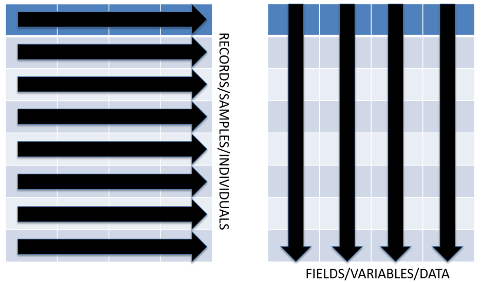

```{r setup, include=FALSE}
library(tidyverse)
library(magrittr)
library(learnr)
library(RColorBrewer)
# ar_exp <- read_delim(file="AR_Expression_cBioPortal.txt", delim="\t", 
#                      col_names=TRUE, col_types="cffffn", 
#                      na=c("", "-", "NA", "missing", "Inf", "-Inf"))
# ar_exp %<>% mutate(Value = round(log(Value + 0.1, base=2), digits=4))

load("ar_exp.rda")

vectorPlot <- function(){
    plot(c(0, 1), c(0, 1), type="n", yaxt="n", xaxt="n", ylab="", xlab="", 
         bty="n", main="Aligned Vectors")
    text(x=c(0.2, 0.5, 0.8), y=0.9, labels=c("A", "B", "C"), pos=3)
    arrows(0.2, 0.9, 0.2, 0.1, col="red2", lty=1, lwd=20, lend="butt")
    text(x=0.2, y=seq(from=0.8, to=0.2, by=-0.1), labels=1:7)
    arrows(0.5, 0.9, 0.5, 0.1, col="deepskyblue2", lty=1, lwd=20, lend="butt")
    text(x=0.5, y=seq(from=0.8, to=0.2, by=-0.1), labels=1:7)
    arrows(0.8, 0.9, 0.8, 0.1, col="green2", lty=1, lwd=20, lend="butt")
    text(x=0.8, y=seq(from=0.8, to=0.2, by=-0.1), labels=1:7)
    segments(x0=0.2, y0=seq(from=0.8, to=0.2, by=-0.1), x1=0.8, y1=seq(from=0.8, to=0.2, by=-0.1), lty=2)
}

vectorPlotScrambled <- function(){
    plot(c(0, 1), c(0, 1), type="n", yaxt="n", xaxt="n", ylab="", xlab="", 
         bty="n", main="Scrambled Vectors")
    text(x=c(0.2, 0.5, 0.8), y=0.9, labels=c("A", "B", "C"), pos=3)
    arrows(0.2, 0.9, 0.2, 0.1, col="red2", lty=1, lwd=20, lend="butt")
    text(x=0.2, y=seq(from=0.8, to=0.2, by=-0.1), labels=1:7)
    arrows(0.5, 0.9, 0.5, 0.1, col="deepskyblue2", lty=1, lwd=20, lend="butt")
    text(x=0.5, y=seq(from=0.8, to=0.2, by=-0.1), labels=c(6, 7, 2, 3, 1, 5, 4))
    arrows(0.8, 0.9, 0.8, 0.1, col="green2", lty=1, lwd=20, lend="butt")
    text(x=0.8, y=seq(from=0.8, to=0.2, by=-0.1), labels=c(2, 1, 5, 6, 4, 7, 3))
}

dataframePlot <- function(){
    plot(c(0, 1), c(0, 1), type="n", yaxt="n", xaxt="n", ylab="", xlab="", 
         bty="n", main="Tibble")
    text(x=c(0.2, 0.5, 0.8), y=0.9, labels=c("A", "B", "C"), pos=3)
    segments(0.2 , 0.86, 0.8, 0.86, lwd=20, col="grey50", lend="butt")
    arrows(0.2, 0.9, 0.2, 0.1, col="red2", lty=1, lwd=20, lend="butt")
    text(x=0.2, y=seq(from=0.8, to=0.2, by=-0.1), labels=1:7)
    arrows(0.5, 0.9, 0.5, 0.1, col="deepskyblue2", lty=1, lwd=20, lend="butt")
    text(x=0.5, y=seq(from=0.8, to=0.2, by=-0.1), labels=1:7)
    arrows(0.8, 0.9, 0.8, 0.1, col="green2", lty=1, lwd=20, lend="butt")
    text(x=0.8, y=seq(from=0.8, to=0.2, by=-0.1), labels=1:7)
    segments(x0=0.2, y0=seq(from=0.8, to=0.2, by=-0.1), x1=0.8, y1=seq(from=0.8, to=0.2, by=-0.1), lty=2)
}

dataframeSortPlot <- function(){
    plot(c(0, 1), c(0, 1), type="n", yaxt="n", xaxt="n", ylab="", xlab="", 
         bty="n", main="Sorted Tibble")
    text(x=c(0.2, 0.5, 0.8), y=0.9, labels=c("A", "B", "C"), pos=3)
    segments(0.2 , 0.86, 0.8, 0.86, lwd=20, col="grey50", lend="butt")
    arrows(0.2, 0.9, 0.2, 0.1, col="red2", lty=1, lwd=20, lend="butt")
    text(x=0.2, y=seq(from=0.8, to=0.2, by=-0.1), labels=c(7, 5, 3, 1, 6, 4, 2))
    arrows(0.5, 0.9, 0.5, 0.1, col="deepskyblue2", lty=1, lwd=20, lend="butt")
    text(x=0.5, y=seq(from=0.8, to=0.2, by=-0.1), labels=c(7, 5, 3, 1, 6, 4, 2))
    arrows(0.8, 0.9, 0.8, 0.1, col="green2", lty=1, lwd=20, lend="butt")
    text(x=0.8, y=seq(from=0.8, to=0.2, by=-0.1), labels=c(7, 5, 3, 1, 6, 4, 2))
    segments(x0=0.2, y0=seq(from=0.8, to=0.2, by=-0.1), x1=0.8, y1=seq(from=0.8, to=0.2, by=-0.1), lty=2)
}

knitr::opts_chunk$set(echo = TRUE)
knitr::opts_chunk$set(cache = FALSE)
knitr::opts_chunk$set(fig.width=8)
knitr::opts_chunk$set(fig.height=8)
```

## Introduction  
**R** has existed for more than 20 years, but there has been explosive growth in **R** in the last five years.  This has lead to the re-evaluation of how certain things are done in **R**.  


The standard **R** data structure for many analyses is the **data frame**.  Likewise, the standard **R** package for plotting is named **graphics**.  If you continuing working in **R**, you will certainly encounter both.   

However, new packages suchs as **dplyr** and **ggplot2** are strongly supported by **RStudio** with Cheatsheets embedded in the **RStudio** Help menu.  In addition, the naming conventions and syntax of these packages are more literate, making them easier to read, and uniform, making them easier to learn.  Many of these packages have been gathered into a "meta-package" named **tidyverse**.  

In this context, **tidy** has several meanings.  First, **tidy** means that the packages work best with **tidy** data, rectangular data with records/observations/samples in rows and variables in columns.  Second, **tidy** means that the **R functions** are easy to use with consistent syntax.  Third, **tidy** means that the **R code** is structured so that it is literate and easy to follow.  

## Tibbles  

The previous tutorial on **vectors** demonstrated that you can perform data analyses with simple **R objects**.  However, this approach is fraught with potential problems because data in a **vector** has a specific order.  If the **values** in a **vector** are changed, then mistakes can occur.  

This tutorial covers **tibbles**, a modified version of a **data frame**, a very common **R** data structure similar to an Excel worksheet in some respects.  **Tibbles** retain the best features of a **data frame**, but discard some problematic issues.  In addition, **tibbles** have new features that make them very efficient for data analysis.  

You have already worked with **numeric** and **character vectors** and a similar **object** called a **factor**.  You used these **objects** to create plots and tables to explore data.  This was possible because the data in the **vectors** was aligned so that data at each position applied across the **vectors**, i.e. values in position one for each vector applied to the same observation.  

Run the cell below to produce a plot to illustrate this point.

```{r q60, exercise=TRUE, exercise.startover=TRUE}
vectorPlot()
```

However, you can sort or reorder **vectors**, so what happens if your values are no longer aligned? 

Run the cell below to produce a plot that illustrates this situation.

```{r q61, exercise=TRUE, exercise.startover=TRUE}
vectorPlotScrambled()
```

As shown in the plot, the positions in **vector** `B` and `C` are not aligned with **vector** `A`.  Any analysis that uses data across **vectors** `B` or `C` will not be accurate. 

So, how can you store data when multiple variables are stored for each sample, record or observation?  The answer is a **tibble**, a series of linked **vectors** that create a rectangular data structure, i.e. there are rows and columns.  

Run the cell below to generate a plot that illustrates the linked **vectors** of a **tibbles**.

```{r q62, exercise=TRUE, exercise.startover=TRUE}
dataframePlot()
```

If you reorder the values in a **tibble**, all **vectors** in that **tibble** are also reordered.

Run the cell below to generate a plot that illustrates this.

```{r q63, exercise=TRUE, exercise.startover=TRUE}
dataframeSortPlot()
```

## Create a **Tibble** with `read_delim`  

So, how do you make a **tibble**?  

There are three ways to create a **tibble**.  

1. Use the function `tibble` to create one from scratch.  
2. Use the function `as_tibble` to convert a **data frame** to a **tibble**.  
3. Use the functon `read_delim` to create a **tibble** from a text file.  

The **function** `read_delim` will create a **tibble** by reading data from a text file.  Reading data from a text file is likely the most common way to import data with **R**.  There are many ways to organize data in a text file, and a common format has data arranged in rows and columns similar to an Excel worksheet.  You can also import Excel worksheets, but that requires a different function.  



The variables or columns in these files are separated or **delim**ited by characters such as a **tab** or **comma**.  In addition, each row of data terminates with a character string that indicates a new line.  

When you started this tutorial, a **tibble** was created with the code in the chunk below.  In the context of a **learnR tutorial**, this step cannot be made interactive.  You can see the code, but you cannot change it. 

```{r eval=FALSE, echo=TRUE}
ar_exp <- read_delim(file="AR_Expression_cBioPortal.txt", delim="\t", 
                     col_names=TRUE, col_types="cffffn", 
                     na=c("", "-", "NA", "missing", "Inf", "-Inf"))
```

The **argument** `delim="\t"` indicates that the file has **tab-delimited** columns.  The text pattern `"\t"` is how tabs are encoded in a plain text file.  These special characters are usually hidden by text editors and word processors.  Other common **delimiters** are commas (csv files) or spaces.  

The **argument** `col_names=TRUE` indicates that the first row should be used as column names.  This can also be set to `FALSE` if the first row of your file contains data.  Alternatively, you can provide a **character vector** of column names.  

The **argument** `col_types="cffffn"` indicates the **data type** for each column using a simple **character string** as follows:  

|Data Type  |Character|
|:--------------------|:-----|
| **character** | "c" |
| **numeric** | "n" |
| **integer** | "i" |
| **factor** | "f" |
| **logical** | "l" |
| guess | "?" |
| skip | "-" |
| **date** | "D"|
| **date time** | "T"|
| **time** | "t" |

The **argument** `na=c("", "-", "NA", "missing", "Inf", "-Inf")` indicates which values should be converted to `NA`.  This argument is very important if you read large files with numeric values where some values are missing.  Several common examples have been included here, but there are many possibilities.  

You may need to adjust these options until the data is imported as you want.  In addition, there are several other arguments that you might need.  See the help page for `read_delim`.  

Note that the function `read_delim` was used and **NOT** `read.delim`.  The first is a **tidyverse R function** that will create a **tibble**.  The latter is an **old school R** function that will create a **data frame**.  In general, do not use `read.delim` in this class because it makes certain assumptions about your data that might not be true!  

The **class** of a **tibble** is confusing.  It essentially has three classes.  Importantly, it behaves much like the **data frame**.  

```{r q65, exercise=TRUE, exercise.startover=TRUE}
class(ar_exp)
```

To examine the data in a **tibble**, simply enter its name.  In an RMarkdown document, you should be able to browse down the rows and across the columns.  In addition, the size (rows and columns) and class of each variable should be shown (under the column names).  

```{r q66, exercise=TRUE, exercise.startover=TRUE}
ar_exp
```

This data was downloaded from [cBioPortal](http://www.cbioportal.org/){target="_blank"} and contains data for about 9100 samples from multiple cancer studies.

You can use `summary` to get a quick summary of each column or variable in a **tibble**.  Remember the issue with rounding of numbers from the **vectors** lesson!

```{r q69, exercise=TRUE, exercise.startover=TRUE}
summary(ar_exp)
```

## Renaming Columns with `rename`  

One problem with this data is that the column names contain special characters, i.e. spaces.  **Base R** functions like `read.delim` (not `read_delim`) will address this issue by replacing all special characters with a period.  The **tidyverse R** function `read_delim` will leave your column names "as is", but any column names with special characters must be used carefully.  

Here is a quick example (jumping ahead a bit).  

You can create a subset of a **tibble** by selecting specific columns by name without using quotes or back ticks.  For example, we can select the variables `Mutation` and `Value` from `ar_exp`.  

```{r q70, exercise=TRUE, exercise.startover=TRUE}
select(ar_exp, Mutation, Value)
```

But, you will get an error if you try to select `Cancer Study` because this column name contains a space.  You can fix this by flanking `Cancer Study` with backquotes (the key to the left of the number 1).  Single quotes and double quotes work as well.  In fact, in **base R**, column names must always be quoted, even if there are no special characters!  

```{r q71, exercise=TRUE, exercise.startover=TRUE}
select(ar_exp, `Cancer Study`, Mutation)
```

One advantage of **tidyverse R** is that you can use "naked" column names, i.e. no quotes.  Therefore, we are going to fix the column names that have bad naming conventions.  Here are some rules for valid names in **R**.  

**R Naming Conventions**  

1.  Names cannot start with a number.  
2.  The only allowed special characters are the underscore and period, but do not begin names with these special characters.  This is reserved for special cases.  
3.  **CamelCase** and **semiCamelCase** are allowed.  Remember, **R IS CASE SENSITIVE**, so `myObject` and `MyObject` are different names!  

Renaming columns is simple with the function `rename`.  The first **argument** is the **tibble** that you want to change.  You then list the columns that you need to rename as `new_name = old_name` pairs.  You may need to use backtick or quotes with the old column names, but you do not need to use them with the new names.  

This **expression** is a simple example of **recursion**, i.e. we are creating an **object** named `ar_exp` from an **object** named `ar_exp`.  Simply put, we are overwriting the old object.  Recursive techniques are very common in computer programming, but you need to be careful, e.g. after we `rename` the columns, the old column names are gone.  

```{r q72, exercise=TRUE, exercise.startover=TRUE}
ar_exp <- rename(ar_exp, 
                 Sample=`Sample Id`, 
                 Study=`Cancer Study`, 
                 Profile=`Profile Name`)
ar_exp
```

```{r prepare-arexp, include=FALSE}
ar_exp <- rename(ar_exp, 
                 Sample=`Sample Id`, 
                 Study=`Cancer Study`, 
                 Profile=`Profile Name`)
```

Now, we can manipulate the **tibble** more efficiently.  

## Extract Rows by Number with `slice`  

Unlike Excel, with **R** you generally don't see the data when you analyze it.  With Rmarkdown, you can browse through a **tibble**.  However, there are instances when you will need to extract specific rows and/or columns.  There are multiple ways to do each of these operations.  

You can extract a single row or multiple rows by row number with `slice`.  For example, the chunk below will extract row 100.  

```{r q73, exercise=TRUE, exercise.startover=TRUE, exercise.setup="prepare-arexp"}
slice(ar_exp, 100)
```

You can extract a sequence of rows if you use `slice` with the colon operator, `:`.

```{r q74, exercise=TRUE, exercise.startover=TRUE, exercise.setup="prepare-arexp"}
slice(ar_exp, 11:20)
```

You can use the sequence generation function, `seq`, to create complex sequences of numbers.  

```{r q75, exercise=TRUE, exercise.startover=TRUE, exercise.setup="prepare-arexp"}
slice(ar_exp, seq(from=5, to=100, by=5))
```

You can use the combine function, `c`, to extract a combination of specific rows.  

```{r q76, exercise=TRUE, exercise.startover=TRUE, exercise.setup="prepare-arexp"}
slice(ar_exp, c(1, 13, 11, 5, 11, 3))
```

In fact, you seldom need to extract rows by number, but the need may arise.  

Use the chunk below to practice with `slice`.  

```{r q76b, exercise=TRUE, exercise.startover=TRUE, exercise.setup="prepare-arexp"}

```

## Extract Rows by a Variable with `top_n`  

More frequently, you will want to extract rows based on the values of one or more of your variables (columns).  You can do this with the function `top_n`.  It requires three **arguments**.  

1. x = The **tibble** with the data.  
2. n = The number of rows to extract.  Positive values extract the top `n` rows and negative value extract the bottom `n` rows.  
3. wt = The variable to use to sort the data.  

The chunk below will extract the samples with the ten highest values for AR expression.  

```{r q77, exercise=TRUE, exercise.startover=TRUE, exercise.setup="prepare-arexp"}
top_n(x=ar_exp, n=10, wt=Value)
```

Note, the rows are displayed in their original order, not in the sorted order.  

You can see the bottom ten by using `n = -10`.  (The argument names have been omitted in the chunk below because the values for the arguments are provided in the expected order as shown on the `top_n` help page).

```{r q78, exercise=TRUE, exercise.startover=TRUE, exercise.setup="prepare-arexp"}
top_n(ar_exp, -10, Value)
```

This also works with **character** variables, but you simply get the results of an alphabetical sort.  

```{r q79, exercise=TRUE, exercise.startover=TRUE, exercise.setup="prepare-arexp"}
top_n(ar_exp, 10, Sample)
```

The function `top_n` sorts the results but it does not change your **tibble**.  There is also a function that you can use to deliberatly arrange the rows of your **tibble**.  

Use the chunk below to practice with `top_n`.  

```{r q79b, exercise=TRUE, exercise.startover=TRUE, exercise.setup="prepare-arexp"}

```

## Extract Rows Using Boolean Expressions with `filter`  

You can devise very complex ways to extract observations from your **tibble** with Boolean expressions.  These filters use one or more of your variables and **relational operators** to construct a data filter.  

The table below contains the most commonly used operators to construct Boolean expressions.  

|English  |R operator|
|:--------------------|:-----|
|equals     |`==`|
|less than          |`<`|
|greater than       |`>`|
|less than or equal |`<=`|
|greater than or equal |`>=`|
|range              |`between`|
|and                |`&`|
|or                 |`|`|
|not                |`!`|
|evaluation order   |`()`|
|table matching     |`%in%`|

The result of a Boolean expression is a **logical vector**, i.e. a series of `TRUE` or `FALSE` (and sometimes `NA`) based on the number of values in the vector used in the expression.  

Here is a simple example that determines which numbers are greater than 5 in the sequence `1:10`.  

```{r q80, exercise=TRUE, exercise.startover=TRUE, exercise.setup="prepare-arexp"}
1:10 > 5
```

The chunk below will return `TRUE` for numbers between 2 and 4 inclusive.  

```{r q81, exercise=TRUE, exercise.startover=TRUE, exercise.setup="prepare-arexp"}
between(1:10, 2, 4)
```

You can use expression like this with the function `filter` to extract only the rows where you expression evaluates to `TRUE`.  The chunk below will use exact matching to extract samples with the "Q58L" mutation.  

```{r q82, exercise=TRUE, exercise.startover=TRUE, exercise.setup="prepare-arexp"}
filter(ar_exp, Mutation == "Q58L")
```

We can narrow the filter by including a range for `Value`.  

```{r q83, exercise=TRUE, exercise.startover=TRUE, exercise.setup="prepare-arexp"}
filter(ar_exp, Mutation == "Q58L" & between(Value, 3, 4))
```

There are many other functions that we could use with `filter`, especially with **character** vectors, but we will save these for another tutorial.  

Use the chunk below to practice with `filter`.  

```{r q83b, exercise=TRUE, exercise.startover=TRUE, exercise.setup="prepare-arexp"}

```

## Extract Columns as a Tibble with `select`

You can select one or more columns from a **tibble** with the function `select`.  Importantly, the result is a new **tibble** that contains only the specified columns.  The order of the columns in the new **tibble** is determined by the order in which you `select`ed the variables, so `select` is frequently used to simply change the order of your variables (columns).  

The chunk below will change the order of our columns and save it to `ar_exp`.  

```{r 84, exercise=TRUE, exercise.startover=TRUE, exercise.setup="prepare-arexp"}
ar_exp <- select(ar_exp, Gene, Value, Mutation, Sample, Study, Profile)
ar_exp
```

This operation does not really change the data in anyway.  It simply changes the order of the columns.  You can drop columns this way if you require only a subset of your data.  

The chunk below will only retain three columns.  In this case, we are not going to save the result to a new object.  

```{r 84a, exercise=TRUE, exercise.startover=TRUE, exercise.setup="prepare-arexp"}
select(ar_exp, Gene, Value, Sample)
```

You can also use ranges of columns with the colon operator, `:`.  

```{r 85, exercise=TRUE, exercise.startover=TRUE, exercise.setup="prepare-arexp"}
select(ar_exp, Gene:Mutation, Study)
```

With the subtraction operator, `-`, you can drop specific columns.  

```{r 86, exercise=TRUE, exercise.startover=TRUE, exercise.setup="prepare-arexp"}
select(ar_exp, -Gene, -Study)
```

You will use the function `select` frequently.  Use the chunk below to practice.  

```{r q86b, exercise=TRUE, exercise.startover=TRUE, exercise.setup="prepare-arexp"}

```
## Extracting Variables with `pull`  

The function `select` creates a **tibble** from a **tibble**.  There are times when you may need to extract a column from a **tibble** as a **vector**.  

Remember, a **vector** is the basic **R** data structure, and many useful **R** functions operate only on **vectors**.   

The need to `pull` variables from a **tibble** is not always apparent when you use **tibbles** with **base R** functions.  For example, the function `nchar` will determine the number of characters in a **character vector**.  

Compare the result when we create a one column **tibble** for `Mutation` and count the number of characters.  

```{r 87, exercise=TRUE, exercise.startover=TRUE, exercise.setup="prepare-arexp"}
samp_tb <- select(ar_exp, Sample)
nchar(samp_tb)
```

This appears to be the number of characters for all values in the `Mutation` column of the **tibble**.  

Compare this to the result if we `pull` the variable `Mutation` from the **tibble** to make a **character vector**. 

```{r 88, exercise=TRUE, exercise.startover=TRUE, exercise.setup="prepare-arexp"}
samp_vc <- pull(ar_exp, Sample)
nchar(samp_vc)[1:100]
```

The extraction operators, `[]`, were used to limit the display to the first 100 values.  The result is dramatically different because `nchar` is intended to return the number of characters for each value in a **character vector**.  Not the sum total of all characters in the vector.  

In fact, the result on the **tibble** is NOT the sum total of all characters in the `Mutation` variable.  We can confirm this by calculating the `sum` on the vector.  

```{r 89, exercise=TRUE, exercise.startover=TRUE, exercise.setup="prepare-arexp"}
samp_vc <- pull(ar_exp, Sample)
sum(nchar(samp_vc))
```

The result using `select` on the **tibble** is spurious.  Generally, it is always best to `pull` a variable from a **tibble** if you need to use a non-**tidyverse** function on the variable.  

Use the chunk below to practice with `pull` and base R functions.  

```{r q89b, exercise=TRUE, exercise.startover=TRUE, exercise.setup="prepare-arexp"}

```

## Arrange Rows with `arrange`  

When we used `top_n` above, the **tibble** was transiently sorted by a variable, and a result was returned.  

You can use the function `arrange` to directly sort a **tibble** by one or more variables.  

This chunk will sort our **tibble** by `Value` and `Study`, in ascending order (smaller values first).  The first listed variable has precedent.  

```{r 90, exercise=TRUE, exercise.startover=TRUE, exercise.setup="prepare-arexp"}
arrange(ar_exp, Value, Study)
```

You can get the descending sort by adding `desc`.  

```{r 91, exercise=TRUE, exercise.startover=TRUE, exercise.setup="prepare-arexp"}
arrange(ar_exp, desc(Value), Study)
```

Use the chunk below to practice with `arrange`.  

```{r q92b, exercise=TRUE, exercise.startover=TRUE, exercise.setup="prepare-arexp"}

```

## Combining Expressions with the Pipe Operator, `%>%`  

Hopefully, you think that functions such as `filter`, `select`, and `arrange` would work well together.  But, how can you easily combine efficiently combine these functions?  With **base R**, you would typically create a new **object** to store the results in stepwise fashion.  

The chunk below will extract `Study` and `Value` for samples with the 20 highest values for AR expression where the gene is not mutated.  

```{r 92, exercise=TRUE, exercise.startover=TRUE, exercise.setup="prepare-arexp"}
ar_exp_a <- filter(ar_exp, Mutation == "Not Mutated")
ar_exp_b <- arrange(ar_exp_a, desc(Value))
ar_exp_c <- slice(ar_exp_b, 1:20)
ar_exp_d <- select(ar_exp_c, Study, Value)
ar_exp_d
```

However, the package **magrittr** provides a way to make this type of manipulation much easier with the **pipe operator**, `%>%`.  Each expression in a **pipe** is evaluated THEN passed to the next expression.  The piped result is used as the value for the first **argument** of the next expression.  Essentially, you create something like an assembly line for your data where each station performs a specific operation that is then passed to the next station.  

This is what we did previously in stepwise fashion.  

Station 1. Filter to extract only samples that were not mutated, THEN  
Station 2. Arrange the samples by descending order of AR expression, THEN  
Station 3. Extract the first 20 samples, THEN  
Station 4. Select only the study and expression value columns.  

We can simply replace these steps with **R** code, joining the expressions with the **pipe operator**, `%>%`.  When you use a **pipe** you do not need to specify the value for data argument except in the first expression.  In fact, you will get an error.  You can use a period, `.`, to indicate the piped value, but this is optional if the piped value is used with the first argument.  

```{r 93, exercise=TRUE, exercise.startover=TRUE, exercise.setup="prepare-arexp"}
filter(ar_exp, Mutation == "Not Mutated") %>% # Station 1
  arrange(., desc(Value)) %>%                 # Station 2
  slice(., 1:20) %>%                          # Station 3
  select(., Study, Value)                     # Station 4
```

What if we wanted to determine the `mean` value for these samples?  (The periods that indicate the piped value have been ommitted from this chunk).

```{r 94, exercise=TRUE, exercise.startover=TRUE, exercise.setup="prepare-arexp"}
filter(ar_exp, Mutation == "Not Mutated") %>%
  arrange(desc(Value)) %>%
  slice(1:20) %>%
  pull(Value) %>%
  mean()
```

It may not be obvious, but a pipe is similar to a **function**, a series of **R** expressions that can be reused to answer other questions.  

For example, what about samples that have confirmed mutations?  

```{r 95, exercise=TRUE, exercise.startover=TRUE, exercise.setup="prepare-arexp"}
filter(ar_exp, !(Mutation == "Not Mutated") & !(Mutation == "Not Sequenced")) %>%
  arrange(desc(Value)) %>%
  slice(1:20) %>%
  select(Mutation, Value)
```

The filter appears to work correctly so we can determine the mean for these samples.  

```{r 96, exercise=TRUE, exercise.startover=TRUE, exercise.setup="prepare-arexp"}
filter(ar_exp, !(Mutation == "Not Mutated") & !(Mutation == "Not Sequenced")) %>%
  arrange(desc(Value)) %>%
  slice(1:20) %>%
  pull(Value) %>%
  mean()
```

Writing a **pipe** is the first step in learning how to write a **function** or **workflow**.  

Use the chunk below to make your own pipes.  

```{r q96b, exercise=TRUE, exercise.startover=TRUE, exercise.setup="prepare-arexp"}

```

## Summarizing Data with `group_by` and `summarize`  

The **pipes** above performed a summary on a group of samples determined by our filter.  You can easily create summaries of groups of samples based on the values of your variables using the functions `group_by` and `summarize`.  

What if we wanted the mean expression of AR by cancer type?  We can use `group_by` on `Study` then use `summarize` to create a new **tibble** with the `mean`.  

The result is a new tibble with the columns `Study` (the grouping variable) and `mean_AR`, a new variable that will be created with `summarize` and `mean`.  

```{r 97, exercise=TRUE, exercise.startover=TRUE, exercise.setup="prepare-arexp"}
study_summary <- ar_exp %>%
  group_by(Study) %>%
  summarize(mean_AR = mean(Value))
study_summary
```

We can quickly add `arrange` to the pipe to get this is descending order.  

```{r 98, exercise=TRUE, exercise.startover=TRUE, exercise.setup="prepare-arexp"}
study_summary <- ar_exp %>%
  group_by(Study) %>%
  summarize(mean_AR = mean(Value)) %>% 
  arrange(desc(mean_AR))
study_summary
```

You can add as many summary variables as you need.  For example, you might want the standard deviation, `sd`.  

```{r 99, exercise=TRUE, exercise.startover=TRUE, exercise.setup="prepare-arexp"}
study_summary <- ar_exp %>%
  group_by(Study) %>%
  summarize(mean_AR = mean(Value), sd_AR=sd(Value)) %>% 
  arrange(desc(mean_AR))
study_summary
```

A data summary is often the first step in an analysis.  Later, we will combine this with data visualization using **ggplot2**.  

Use the chunk below to make a data summary, perhaps by grouping on different variables or using other functions such as `min` or `max`.  

```{r q99b, exercise=TRUE, exercise.startover=TRUE, exercise.setup="prepare-arexp"}

```
## Tallying Groups of Observations with `count`  

Another type of summary is to simply tally or count the number of samples in a given group.  This can be a very useful operation to help you understand a dataset.  

The function `count`, will group your observations by the specified variables and simply tally the number of rows.

For example, how many samples are there for each study?  

```{r q100, exercise=TRUE, exercise.startover=TRUE, exercise.setup="prepare-arexp"}
ar_exp %>%
  count(Study, sort=TRUE)
```

You can include as many grouping variables as you need.  

```{r q101, exercise=TRUE, exercise.startover=TRUE, exercise.setup="prepare-arexp"}
ar_exp %>%
  count(Study, Mutation, sort=TRUE)
```

Note that the result it a **tibble** with the number of observations as a variable named `n`.  

Practive with `count` in the chunk below.  

```{r q101b, exercise=TRUE, exercise.startover=TRUE, exercise.setup="prepare-arexp"}

```

## Saving a Tibble with `write_delim`  

Several times we created **tibbles** that you might want to save as a text file.  The general function for this is `write_delim`, but there are several versions of this function with different default arguments.  Here is an example to save the count table produced above as a tab-delimited text file.  Note, this is not an exercise, so the code is not interactive.  

```{r eval=FALSE, echo=TRUE}
ar_exp %>%
  count(Study, Mutation, sort=TRUE) %>%
  write_delim(x=., path="study_mutation_count.txt", delim="\t", col_names=TRUE)
```

**Tibbles** are likely the most useful data structure to use in **R**.  They are equivalent to Excel worksheets in many respects, but are much less prone to data corruption.  **Tibbles** also mesh very well with many data visualizations and statistical tests.  These will be covered in later tutorials.

## Quiz
Time for a short quiz.  Use the help menu or try various answers as much as you want.  There is no penalty for multiple attempts.  If you are stuck, click the `Hints` button to get progressive hints.  The last hint is the answer!

### Question 1
#### Which variable in `ar_exp` would be the most useful **factor**?
```{r quiz1, echo=FALSE}
question("",
  answer("Mutation", correct=TRUE, message="Correct, there are only 65 mutations."),
  answer("Profile", message="Incorrect, all samples have the same `Profile`."),
  answer("Gene", message="Incorrect, `Gene` is the same for all samples."),
  answer("Value", message="Incorrect, `Value` is a continuous variable.")
)
```

### Question 2
#### How many samples have a **Value** of less than zero?  

```{r quiz2, exercise=TRUE, exercise.startover=TRUE, exercise.setup="prepare-arexp"}
#Enter your code below.
```

```{r quiz2-hint-1}
filter()
```

```{r quiz2-hint-2}
filter(ar_exp)
```

```{r quiz2-hint-3}
filter(ar_exp, Value)
```

```{r quiz2-hint-4}
filter(ar_exp, Value < 0)
```

### Question 3
#### How many samples have the Q63L mutation?

```{r quiz3, exercise=TRUE, exercise.startover=TRUE, exercise.setup="prepare-arexp"}
#Enter your code below.
```

```{r quiz3-hint-1}
count(ar_exp)
```

```{r quiz3-hint-2}
count(ar_exp, Mutation)
```

```{r quiz3-hint-3}
count(ar_exp, Mutation) %>%
  filter()
  
```

```{r quiz3-hint-4}
count(ar_exp, Mutation) %>%
  filter(Mutation == "Q63L")
```

### Question 4
#### Produce a summary table for mean AR expression grouped by study and mutation sorted from highest to lowest value.   

```{r quiz4, exercise=TRUE, exercise.startover=TRUE, exercise.setup="prepare-arexp"}
#Enter your code below.
```

```{r quiz4-hint-1}
ar_exp %>%
```

```{r quiz4-hint-2}
ar_exp %>%
  group_by()
```

```{r quiz4-hint-3}
ar_exp %>%
  group_by(Study, Mutation) %>%
  
```

```{r quiz4-hint-4}
ar_exp %>%
  group_by(Study, Mutation) %>%
  summarize(mean_AR=mean(Value)) %>%
  
```

```{r quiz4-hint-5}
ar_exp %>%
  group_by(Study, Mutation) %>%
  summarize(mean_AR=mean(Value)) %>%
  arrange(desc(mean_AR))
```

Challenge question.  How can you determine the number of samples in each group above?  

There are many more things that you can quickly do with data in a **tibble**.  Future tutorials will show you how to add or change columns and visualize the data in a **tibble**.  
